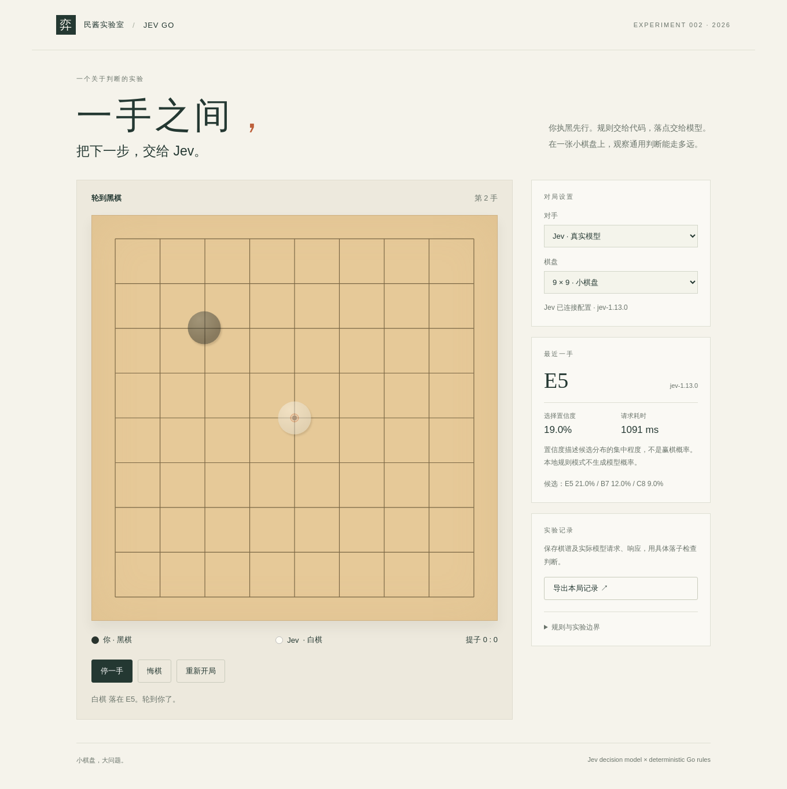

# Jev Go

围棋（默认19路，可选13/9/5路）与自由五子棋（15/9路）的网页实验。Python 3.10+，无第三方 Python 依赖。模型固定 jev-1.13.0；规则由代码执行，Jev 从全部合法动作中选择。

## 界面



[查看手机端截图](evidence/mobile-live.png)

## 启动

在本机解压，进入目录。Bash 可用以下方式输入密钥（不回显），再启动：

```bash
cd jev-go
read -rsp 'TypeSafe API key: ' TYPESAFE_API_KEY
export TYPESAFE_API_KEY
python3 server.py
```

访问 http://127.0.0.1:8765 。如果服务运行在远程机器，可通过 SSH 转发到本机相同端口：`ssh -L 8765:127.0.0.1:8765 user@host`，然后用本机地址访问。端口被占用时使用 `python3 server.py --port 8766`。

没有配置密钥时可运行双人同机或本地规则模式；它们不调用 Jev。真实模式每次模型落子会产生 API 用量。密钥仅在服务端，程序不写入请求证据或网页。接口失败不自动重试，不降级替换模型。当前服务仅监听本机，不是公共托管产品。

## 本次试玩改进

- 默认19路围棋，增加13路；五子棋支持15路、9路，黑先、交替落子、连续五颗及以上获胜，无禁手、不提子、不停手。
- 围棋开局少于棋盘路数两倍手数、对方未停手且还有合法落点时，模型候选不包含 PASS，避免第一手就停手。人类仍可停手，对方停手后模型也可停手结束。
- 围棋超过240个合法落点时，代码按提子/救子、距已有棋子距离、距中心距离预筛240个候选，遵守接口候选数量限制。这可能漏掉好棋。
- 五子棋代码优先筛选本手成五；没有成五则筛选阻挡对方下一手成五的点。候选筛选及连续棋子特征属于程序辅助，不是 Jev 独立棋力，也不能保证挡住双威胁。
- 一次人类落子到模型返回保持锁定，白棋回合不能追加人类落子；新增最近八手记录，明确显示停手。棋子不再因禁用按钮样式变半透明。

以上修改没有经过棋力基准评估，不能声称只改提示词就提升了棋力。

## LLM 对战 Jev

在“LLM 接入”填写兼容 OpenAI Chat Completions 的 Base URL（包含 /v1 等接口前缀）、模型 ID、API Key，再点“应用配置”。支持完整 /chat/completions 地址；仅接入这一协议，不支持原生 Anthropic Messages 或 Responses API。无认证本地服务可留空 Key。

选择“LLM 对战 Jev”，选择谁执黑，先点“走一手”检查接口，再点“开始对战”。每次自动运行默认最多20手，可设为1到100；暂停等待在途请求结束，不再发下一手。双方采用同一局面、候选筛选和战术特征；没有 LLM 校准概率时显示空白，不伪造胜率。错误或非法坐标会暂停，不重试、不替换成其他模型。

也支持“你对战 LLM”：用户执黑。配置仅存于当前页面内存，刷新后清除，不写入浏览器存储或导出记录；应用后会清空密钥输入框，修改配置需重新填写密钥。服务器仅把本次 LLM 凭据发送到配置的接口，不使用 Jev 密钥代替。

远程输入凭据应使用 HTTPS。network_preview.py 支持 --tls-cert 和 --tls-key，证书和私钥不要提交到仓库；推荐有效的可信证书。该入口提供 Basic 登录，启动时随机生成口令。TLS 终止在入口，内部回环服务继续使用 HTTP。

验证：27项单元测试通过；浏览器使用模拟 Chat Completions 接口与真实 Jev，验证轮流落子、交换黑白、单步、自动手数上限、暂停、非法输出停止、人类对战 LLM、导出不含密钥。尚未验证用户实际配置的 LLM 服务。

## 规则与限制

黑先，白贴 6.5，支持提子、禁自杀、全局同形禁着，连续停手两次结束。面积计算统计盘上棋子与被单方包围的空点；没有自动死活判定、死子协商或赛事级裁判。请先提净死子，否则面积有误导性。5×5 也使用 6.5 贴目，实验结果不能用作正式棋力评级。最多 500 手。

模型接收文本棋盘、候选动作和代码计算的战术特征；候选筛选规则见上文。不使用搜索树，不做在线学习。置信度不等于胜率。用户执黑；本地对手是明确标注的手写启发式。

## 验证与复现

```bash
python3 -m unittest discover -s tests -v
```

规则及模型响应校验测试共 27 项。浏览器验证覆盖落子、悔棋、双停手、两类对手、导出与移动布局，证据在 evidence/browser-check.json。

`experiment.py --live` 会真实请求 API 并覆盖 evidence 中同名实验文件；复现前请复制整个目录保存原记录。最多请求 76 次，配置凭据后运行：

```bash
python3 experiment.py --live
```

现有 evidence 记录来自旧版提交 1c6504d，保留作为文章原始证据；当前提示词和候选规则已改变，重新运行不保证复现旧数字。原实验：两个基础战术局面的四向旋转，原始棋盘输入 4/8 命中，添加战术特征 8/8 命中；每格只测一次。两盘 5×5 对局不是棋力基准。汇总 39 次实验请求，不包含接口联调与浏览器请求。费用是按官方输入价估算，不是实际账单。

## 文件

- game.py：规则、候选动作特征、Jev 请求、本地启发式。
- server.py：本机 HTTP 服务与真实 API 调用。
- static/：网页、样式、交互。
- tests/：规则与响应校验测试。
- experiment.py：实验计划、战术对照及双边对局。
- evidence/：原始请求响应、棋谱、汇总、浏览器截图。

分享源码包即可让读者自行运行。包内没有 API 密钥；不要把密钥填入网页或源码后再分发。
